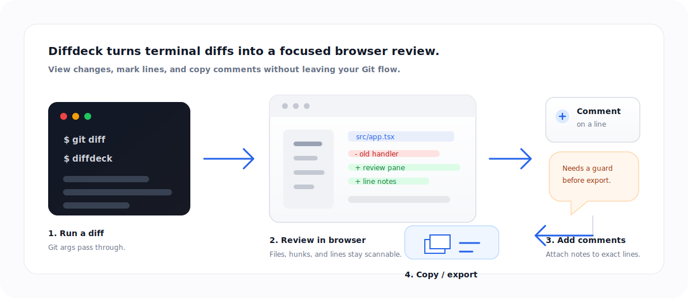

# Diffdeck

Open a Git diff in your browser from the terminal.



`diffdeck` starts a local web UI for the diff you ask Git for, then opens it in your browser. Use it when:

- You do not have a diff view where you are editing.
- `git diff` in the terminal is too hard to read.
- You are SSHed into a server and still want a clean visual review.

You can also leave comments on changed lines and copy all comments with context for a PR, issue, chat, or agent prompt.

## Make It A Drop-In

Diffdeck accepts the same diff arguments, so the simplest setup is a shell alias:

```sh
alias gd='diffdeck'
```

Then use it like `git diff`:

```sh
gd
gd --cached
gd HEAD~1 HEAD
```

## Install

```sh
npm install -g @parthjadhav/diffdeck
```

The package is scoped, but the installed command is `diffdeck`.

## Use It Like Git Diff

```sh
diffdeck
diffdeck --cached
diffdeck HEAD~1 HEAD
diffdeck -- -- '*.tsx'
```

Everything after Diffdeck's own options is passed through to `git diff`.

## Options

| Option | What it does |
| --- | --- |
| `--repo <path>` | Run against another repository. |
| `--port <number>` | Bind to a specific port. Defaults to a free one. |
| `--host <host>` | Bind to a host. Defaults to `127.0.0.1`. |
| `--no-open` | Start the server without opening a browser. |
| `--help` | Show CLI help. |

## Requirements

- Node.js 20 or newer
- Git available on your `PATH`

## Develop

```sh
bun install
bun run dev
bun run check
```

## License

MIT
