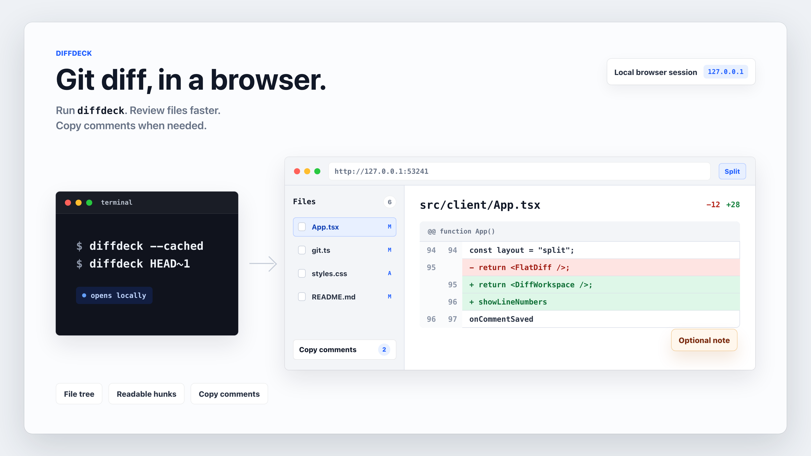

# Diffdeck

[](https://www.npmjs.com/package/@parthj/diffdeck)

Open a Git diff in your browser from the terminal.

<picture>
  <source srcset="docs/diffdeck-demo.gif" type="image/gif" />
  
</picture>

`diffdeck` starts a local web UI for the diff you ask Git for, then opens it in your browser. Use it when:

- You do not have a diff view where you are editing.
- `git diff` in the terminal is too hard to read.
- You are SSHed into a server and still want a clean visual review.

Optionally, you can comment on changed lines and copy all of them at once for your AI to resolve — the surrounding code context goes with them, so the agent has everything it needs to act.

## Agentic Setup

Tell your coding agent (Claude Code, Cursor, etc.):

```
Install `@parthj/diffdeck` globally with `npm install -g @parthj/diffdeck`, then add `alias gd='diffdeck'` to my shell rc file. Run `gd` whenever I ask you to show me a diff.
```

## Install

```sh
npm install -g @parthj/diffdeck
```

The package is scoped, but the installed command is `diffdeck`.

To update to the latest version:

```sh
npm install -g @parthj/diffdeck@latest
```

(`npm update -g` won't bump globally-installed packages because they're pinned to an exact version at install time.)

## Make It A Drop-In

Diffdeck accepts the same diff arguments, so the simplest setup is a shell alias:

```sh
alias gd='diffdeck'
```

Then use it like `git diff`:

```sh
gd
gd --cached
gd HEAD~1 HEAD
```

## Use It Like Git Diff

```sh
diffdeck
diffdeck --cached
diffdeck HEAD~1 HEAD
diffdeck -- -- '*.tsx'
```

Everything after Diffdeck's own options is passed through to `git diff` as long as it still produces plain patch output. Summary-only modes such as `--stat`, `--name-only`, `--raw`, and `--no-patch` are rejected because there is no file patch for the browser to render.

## Options

| Option | What it does |
| --- | --- |
| `--repo <path>` | Run against another repository. |
| `--port <number>` | Bind to a specific port. Defaults to `4321` (falls back to a free port if taken). |
| `--host <host>` | Bind to a host. Defaults to `127.0.0.1`. |
| `--no-open` | Start the server without opening a browser. |
| `--version` | Print the installed version and exit. |
| `--help` | Show CLI help. |

## Requirements

- Node.js 20 or newer
- Git available on your `PATH`

## Develop

```sh
bun install
bun run dev
bun run check
```

## Releases

See [GitHub Releases](https://github.com/ParthJadhav/DiffDeck/releases) for the full version history. Highlights:

- **0.2.0** — File-list virtualization for large diffs (23k+ files), survives non-ASCII patches, comment drafts persist across scroll.
- **0.1.3** — Float copy-comments FAB, render binary file placeholders, oklch theme tokens.
- **0.1.1** — Initial scoped npm release.

## License

MIT
