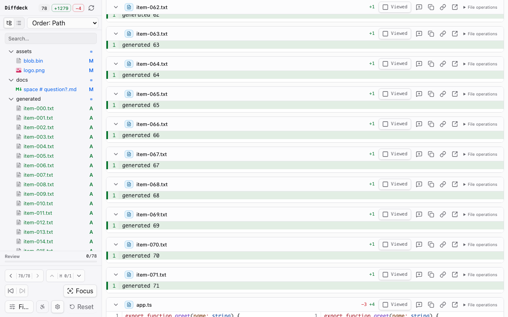

# Diffdeck

[](https://www.npmjs.com/package/@parthj/diffdeck)

Open a Git diff in your browser from the terminal.



`diffdeck` starts a local web UI for the diff you ask Git for, then opens it in your browser. Use it when:

- You do not have a diff view where you are editing.
- `git diff` in the terminal is too hard to read.
- You are SSHed into a server and still want a clean visual review.

Optionally, you can comment on changed lines and copy all of them at once for your AI to resolve — the surrounding code context goes with them, so the agent has everything it needs to act.

## Agentic Setup

Tell your coding agent (Claude Code, Cursor, etc.):

```
Install `@parthj/diffdeck` globally with `npm install -g @parthj/diffdeck`, then add `alias gd='diffdeck'` to my shell rc file. Run `gd` whenever I ask you to show me a diff.
```

## Install

```sh
npm install -g @parthj/diffdeck
```

The package is scoped, but the installed command is `diffdeck`.

To update to the latest version:

```sh
npm install -g @parthj/diffdeck@latest
```

(`npm update -g` won't bump globally-installed packages because they're pinned to an exact version at install time.)

## Make It A Drop-In

Diffdeck accepts the same diff arguments, so the simplest setup is a shell alias:

```sh
alias gd='diffdeck'
```

Then use it like `git diff`:

```sh
gd
gd --cached
gd HEAD~1 HEAD
```

## Use It Like Git Diff

```sh
diffdeck
diffdeck --cached
diffdeck HEAD~1 HEAD
diffdeck -- -- '*.tsx'
```

Everything after Diffdeck's own options is passed through to `git diff` as long as it still produces plain patch output. Summary-only modes such as `--stat`, `--name-only`, `--raw`, and `--no-patch` are rejected because there is no file patch for the browser to render.

## Options

| Option | What it does |
| --- | --- |
| `--repo <path>` | Run against another repository. |
| `--port <number>` | Bind to a specific port. Defaults to `4321` (falls back to a free port if taken). |
| `--host <host>` | Bind to a host. Defaults to `127.0.0.1`. |
| `--no-open` | Start the server without opening a browser. |
| `--watch` | Watch the selected diff and notify the browser when it changes. |
| `--watch-interval <ms>` | Set the watch polling interval from 100 to 60,000 ms (default `750`). |
| `--editor <command>` | Enable “Open in editor” with the configured executable. |
| `--structural` | Enable opt-in Difftastic views when `difft` is installed. |
| `--write` | Enable confirmed stage, unstage, and revert controls. The default is read-only. |
| `--debug` | Print line-numbered parsing diagnostics. |
| `--version` | Print the installed version and exit. |
| `--help` | Show CLI help. |

## Requirements

- Node.js 20 or newer
- Git available on your `PATH`
- Optional: [Difftastic](https://difftastic.wilfred.me.uk/) available as `difft` for structural views

## Review workflow

Review state is stored locally in the browser per repository and normalized Git arguments. Viewed
files, collapsed files, filters, comment drafts, saved comments, and selection survive reloads. On
refresh, unchanged files keep their progress; changed files are reopened and their comments are
re-anchored, resolved, or marked stale.

Comments can be copied as a Markdown review packet, downloaded as versioned JSON, or sent to the
terminal that launched DiffDeck. Image changes support side-by-side, overlay, and swipe comparison.
Supported JavaScript manifests and lockfiles get a package-change summary with a source-diff
fallback.

Use the compact review navigator to move between visible files, unviewed files, and changed hunks,
or switch to persisted focus mode when one file needs full attention. File navigation can be a
directory tree or a virtualized flat list ordered by path, status, or change size. Diff settings can
rebuild the Git patch while ignoring end-of-line spaces, spacing amount, all whitespace, or blank
line changes.

Each file header can create a file-level note, copy its repository-relative path or exact link, and
open the configured editor at the selected line. The Review notes queue consolidates file and line
notes for edit, delete, reopen, and source jumps. Before handoff, expand Preview exact packet to
inspect the exact Markdown or versioned JSON that will be copied, downloaded, or sent to the launch
terminal.

The accessible linear patch is a first-class review surface with keyboard change navigation,
coherent line announcements, comments, and existing note statuses. At narrow widths, Files and
Review become two explicit places instead of squeezing the patch.

### Keyboard shortcuts

| Key | Action |
| --- | --- |
| `j` / `k` | Next / previous visible file |
| `Shift+j` / `Shift+k` | Next / previous unviewed file |
| `n` / `p` | Next / previous changed hunk |
| `f` | Toggle focus mode for the selected file |
| `a` | Toggle the accessible linear patch for the selected file |
| `v` | Toggle viewed for the selected file |
| `c` | Start a comment at the first changed line |
| `x` | Collapse or expand the selected file |
| `/` | Focus path filters |
| `s` | Open diff settings |
| `o` | Open the selected file in the configured editor |
| `?` or `Cmd/Ctrl+K` | Open the command palette and shortcut reference |
| `Cmd/Ctrl+Enter` | Submit the comment, note, or edit you are typing |
| `Esc` | Leave a comment box with the draft intact, or close the open panel |

Typing always wins. While focus is in any text field — a comment box, the path filter, the file
search, the command palette, or a native select — every key is text and no single-key shortcut
fires. Open dialogs, popovers, and menus own the keyboard until they close (`Esc`). Holding a key
steps through files and hunks but never flips a toggle back and forth, and IME composition
keystrokes are never shortcuts. Each comment box shows how to hand the keyboard back:
`Cmd/Ctrl+Enter` to finish, `Esc` to leave.

## Security and repository writes

DiffDeck binds to loopback by default. When `--host` exposes it beyond loopback, the CLI generates a
random capability token, prints and opens the complete tokenized URL, and requires that token for
every API, event, image, editor, structural, terminal, and write request. Treat that URL as a secret:
anyone who has it can read the selected diff while the process is running.

Repository mutation controls do not exist unless DiffDeck starts with `--write`. Every action is
restricted to a path in the current snapshot; stale snapshots are rejected. Revert actions require
confirmation, and file or individual-hunk scope is shown before the action runs.

## Develop

```sh
bun install
bun run dev
bun run check
```

## Releases

See [GitHub Releases](https://github.com/ParthJadhav/DiffDeck/releases) for the full version history. Highlights:

- **Next release** — Review navigator/focus mode, safe deep links and file notes, Git-owned
  whitespace modes, tree/flat ordering, review notes and exact packet preview, accessible patch,
  responsive redesign, and exhaustive release hardening. See
  [release notes](docs/RELEASE_NOTES.md) and
  [verification evidence](docs/RELEASE_VERIFICATION_2026-07-16.md).
- **0.3.8** — Refined the review UI with shared controls, icons, compact states, and better mobile diff layout.
- **0.3.7** — Browser page refreshes now reload the current git status instead of reusing a cached session.
- **0.2.0** — File-list virtualization for large diffs (23k+ files), survives non-ASCII patches, comment drafts persist across scroll.
- **0.1.3** — Float copy-comments FAB, render binary file placeholders, oklch theme tokens.
- **0.1.1** — Initial scoped npm release.

## License

MIT

## Author

Created by [Parth Jadhav](https://www.parthjadhav.com/).
