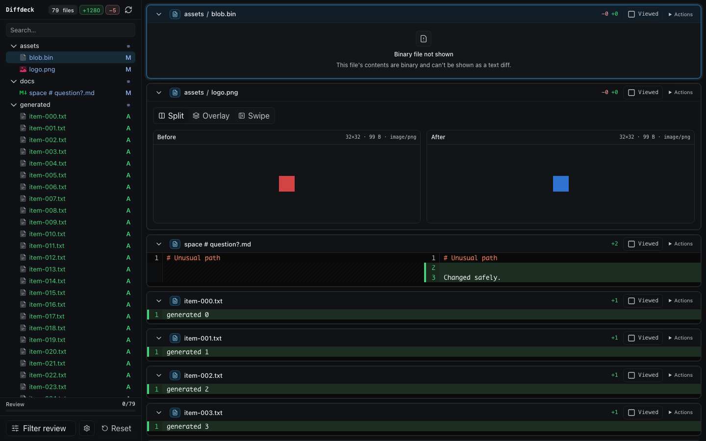
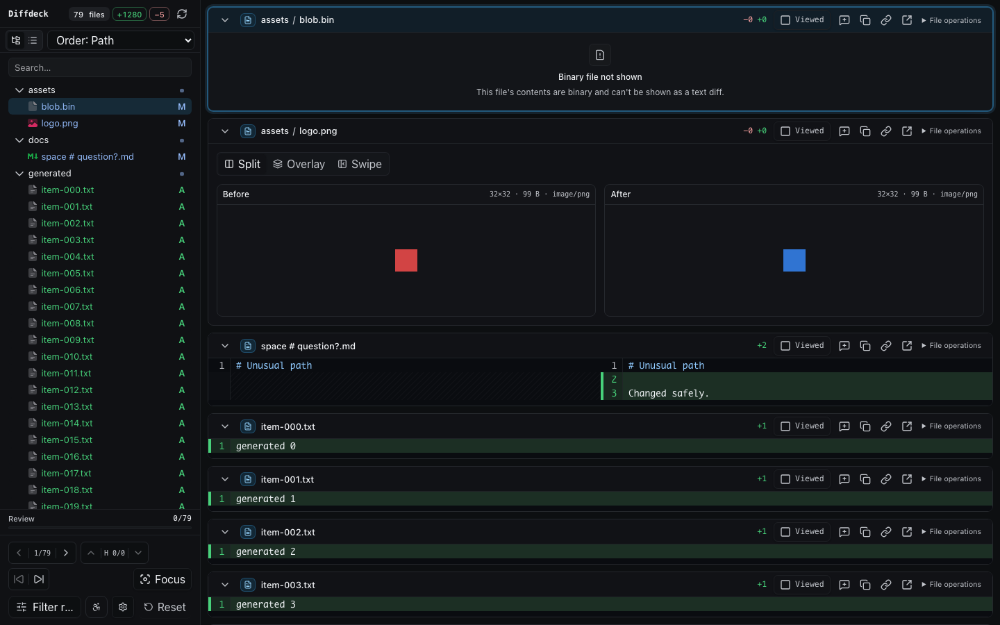
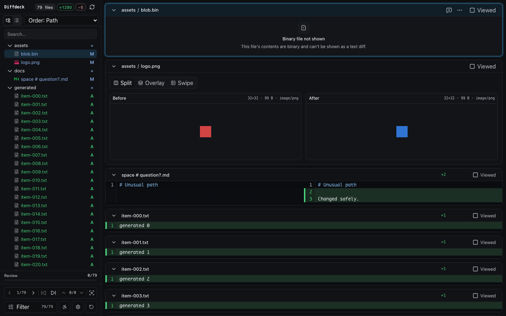
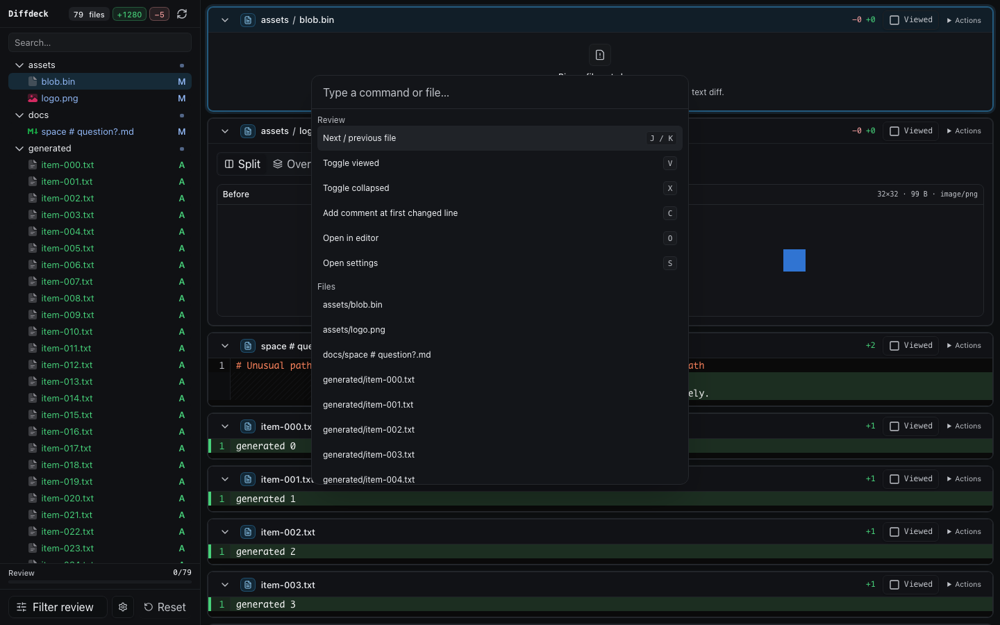
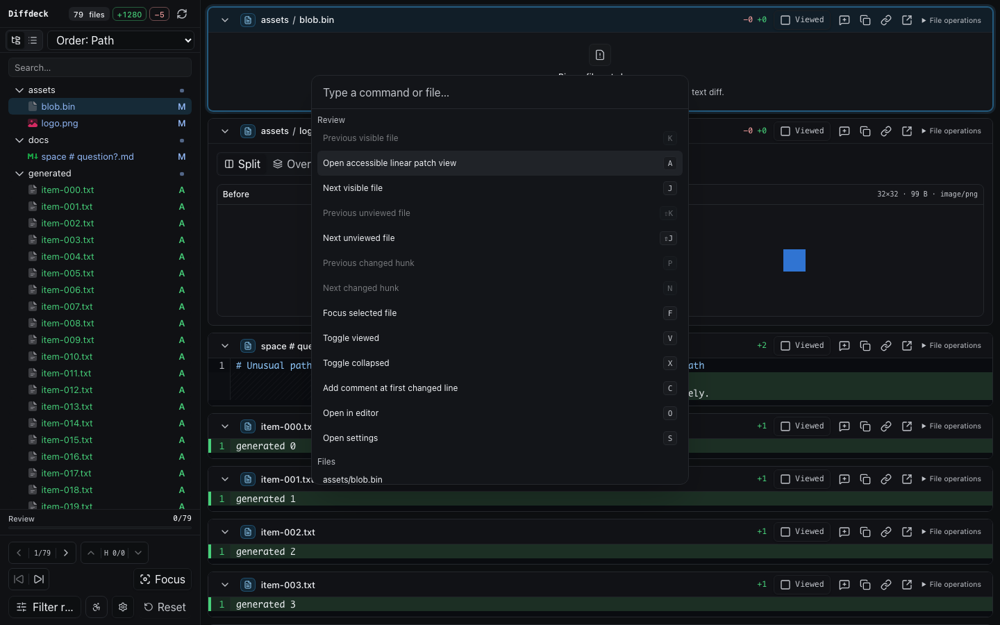
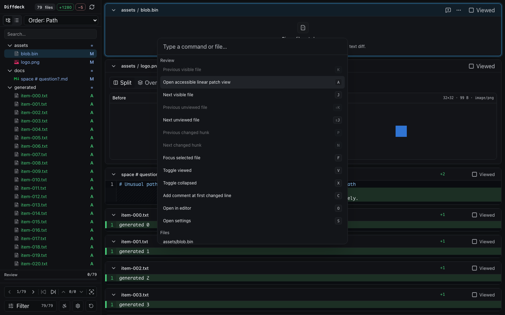
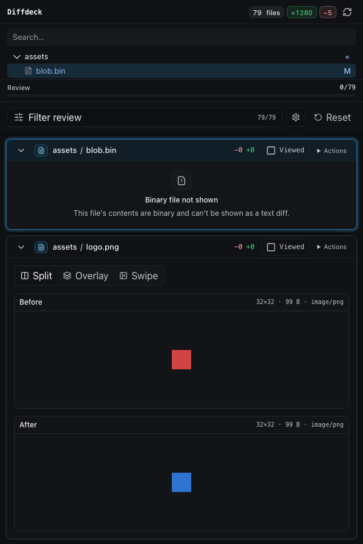
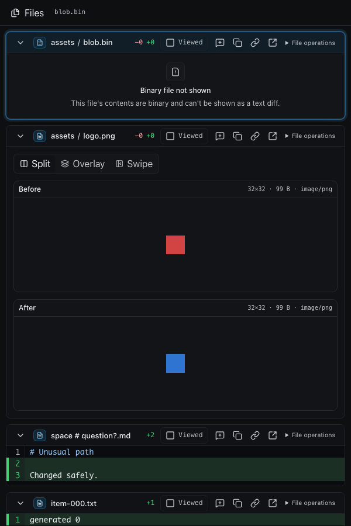
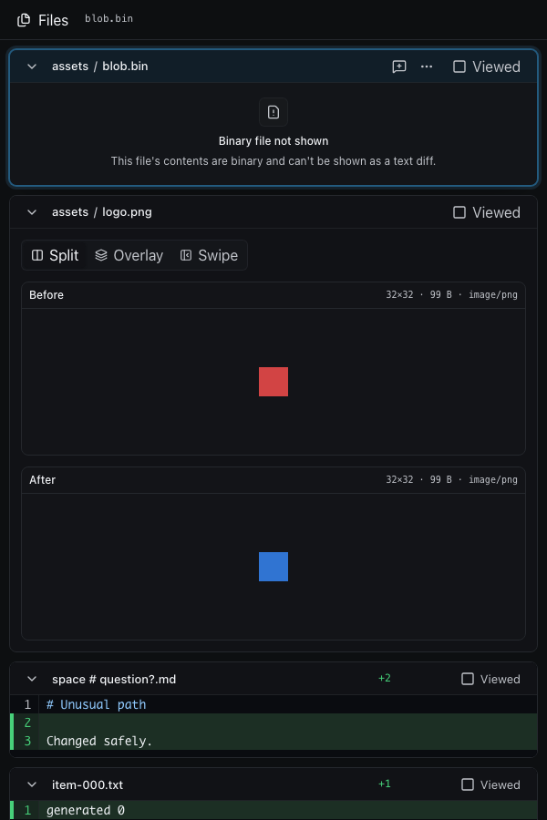

# Visual comparison

Three states of the interface, in order:

1. **Original** — `main`, the currently shipped interface.
2. **This PR** — `c68f316`, the review-workflow expansion as first written.
3. **Now** — the same PR after the interface pass.

Unlike the earlier version of this document, all three columns render the **same fixture
repository** at the same viewport, so every difference below is the interface changing rather than
the content changing. Regenerate them with the fixture factory in `scripts/fixture-factory.mjs`
driving one build per state.

## Desktop review workspace — 1440 × 900

The PR added real capability — file ordering, view modes, file/hunk/unviewed navigation, focus
mode, and per-file utilities — but spent a lot of screen budget doing it. Each of the 79 file
headers carried six controls including a `File operations` disclosure that expanded inside the
header row, and the sidebar footer could not fit its four control groups, so the navigator wrapped
to a second row and the filter button truncated to `Filter r…`.

The third column keeps every capability and reallocates the space by one rule: **persistent visual
weight should be proportional to how often something is used.** Across a 79-file review you read
the path and the counts constantly and toggle viewed roughly 79 times; you copy a path, open an
editor, or revert a hunk a handful of times in total.

So the header keeps the path, the counts, and `Viewed` — and nothing else at rest. The note button
and overflow menu hold their layout space but stay transparent until the row is hovered, focused,
or selected, which means no row ever shifts when they appear. The decorative file-type badge is
gone: it rendered the same glyph for every file and repeated an answer the path already gives. Zero
line counts (`-0 +0` on binary and mode-only changes) are no longer drawn.

| Original (`main`) | This PR (`c68f316`) | Now |
| --- | --- | --- |
|  |  |  |

Elements drawn per file header at rest: 8 → 10 → 4.

The sidebar footer changed on the same principle: the navigator is one segmented bar rather than
four wrapping groups, and the tool row is unified on one size and radius. The shorter footer
returns two rows of file tree to the sidebar.

## Command palette — 1440 × 900

The palette gained visible/unviewed file navigation, changed-hunk navigation, focus mode, the
accessible patch, and bounded file search. It is unchanged by the interface pass and is included
so the comparison covers the whole surface.

| Original (`main`) | This PR (`c68f316`) | Now |
| --- | --- | --- |
|  |  |  |

## Narrow review — 600 × 900

The stacked layout became an explicit Files/Review workflow with a full-width review surface. At
this width the per-file control row was the most crowded, so collapsing it into an overflow menu
matters most here.

| Original (`main`) | This PR (`c68f316`) | Now |
| --- | --- | --- |
|  |  |  |

## Enforced baselines

Seven deterministic Playwright baselines covering desktop, dependency, image, annotation, narrow,
empty, and fatal-error states live in `e2e/__screenshots__/visual.e2e.ts/` and are enforced by the
release check.

Note that those baselines compare with `maxDiffPixelRatio: 0.03`. That tolerance is loose enough to
absorb a change of the size shown above — removing three icons from every file header did not trip
it — so treat them as a guard against gross regressions, not as a record of the current design.
