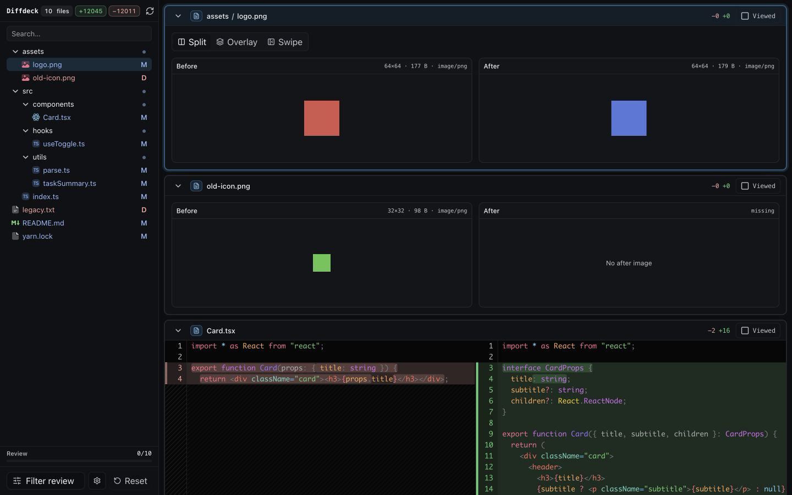
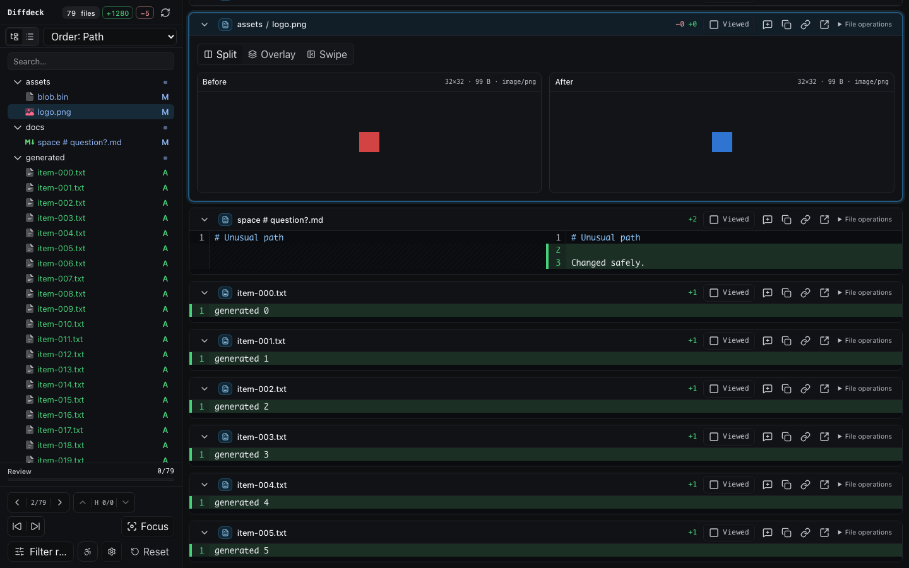
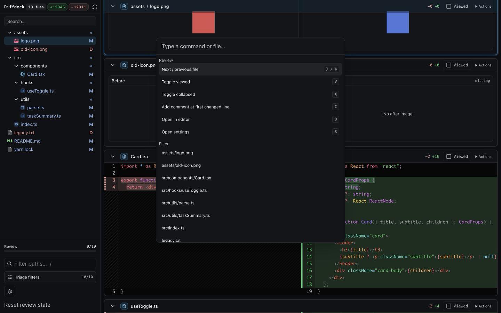
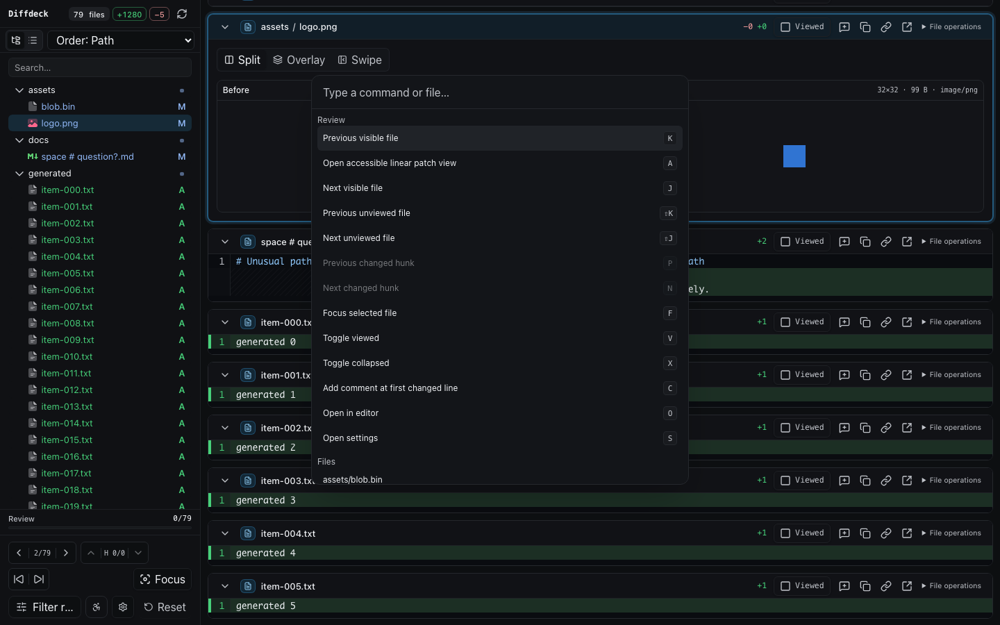
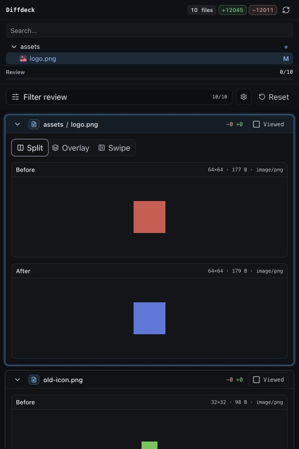
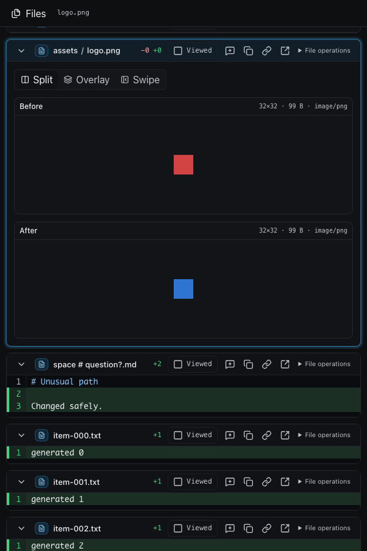

# Visual comparison

These screenshots compare the previous shipped interface with the completed improvement program.
They use representative local Git fixtures at matching viewport sizes; fixture contents differ, so
the comparison is intended to show hierarchy, controls, responsive behavior, and workflow density
rather than serve as a pixel diff.

## Desktop review workspace — 1440 × 900

The new workspace adds explicit file ordering and view modes, file/hunk/unviewed navigation, focus
mode, consistent file utilities, and a denser but more legible review footer.

| Before | After |
| --- | --- |
|  |  |

## Command palette — 1440 × 900

The palette now exposes visible/unviewed file navigation, changed-hunk navigation, focus mode, the
accessible patch, review actions, and bounded file search. It prefilters large repositories before
rendering command items.

| Before | After |
| --- | --- |
|  |  |

## Narrow review — 600 × 900

The previous stacked layout has become an explicit Files/Review workflow with a full-width review
surface, stable selected-file context, and touch-friendly file actions.

| Before | After |
| --- | --- |
|  |  |

Seven deterministic Playwright baselines covering desktop, dependency, image, annotation, narrow,
empty, and fatal-error states live in `e2e/__screenshots__/visual.e2e.ts/` and are enforced by the
release check.
